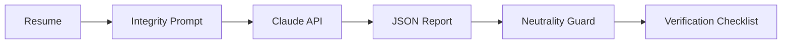

# Resume Integrity Checker

A Python tool that reviews a resume for internal inconsistencies and unverifiable
claims, and produces a neutral checklist of items for a human to verify. Built with
the Claude API.

**It does not accuse anyone of anything.** It does not score fit. It does not screen
identity documents. It surfaces "things worth confirming" — and a human decides.

## What It Does

1. Reads a resume (PDF or text)
2. Asks Claude to find internal inconsistencies and unconfirmable claims, such as:
   - Timeline math that doesn't add up (years of experience exceeding the span since
     graduation; overlapping full-time roles)
   - Credential or certification claims with no issuing body or identifier
   - Title or scope claims that are vague or unusually senior for the stated tenure
3. Returns a checklist: each item has a category, severity, a neutral observation,
   and the concrete thing a human should verify
4. Writes it to a CSV for the recruiter to work through during reference checks

## Why It's Built This Way

**Verify, don't accuse.** An LLM's judgment about whether someone is being truthful is
probabilistic and can be wrong or biased. Treating that judgment as an accusation would
be unfair and indefensible. So every output is framed as a neutral *item to verify* — the
tool hands a recruiter a better checklist, not a verdict.

**A neutrality guard in code, not just in the prompt.** The prompt forbids words like
"fraud," "lie," and "fake" — but prompts can be ignored. The test suite includes a
guard that fails if accusatory language ever appears in the output, so the neutrality
commitment is enforced, not just requested. See `tests/`.

**Human-in-the-loop by design.** Nothing is rejected, scored, or decided by the system.
It produces a checklist a person uses.

## Architecture

## Setup

1. Clone or download this repo
2. Install dependencies: `pip install -r requirements.txt`
3. Copy `.env.example` to `.env` and add your Anthropic API key
4. Drop resumes in `data/resumes/`
5. Run: `python src/integrity_checker.py`

## Scope and Limits

This tool flags **items to verify** based on what's inside a single resume. It cannot
confirm or deny any claim — only a human checking references, credentials, or records
can do that. A flag means "worth confirming," never "this is false." It is a companion
to, not a replacement for, proper background and reference checks.

## Relationship to My Other Tools

- [AI Resume Screener](https://github.com/builtbybianca/ai-resume-screener) — scores
  candidate *fit* (separate concern, separate tool)
- [IDV Fraud Detection](https://github.com/builtbybianca/hr-idv-fraud-detection) —
  screens *identity documents* for manipulation (separate concern, separate tool)

Each tool does one thing well. This one builds a verification checklist.

## Status

Built as a standalone tool. This public version uses synthetic example resumes; no real
candidate information is included.
